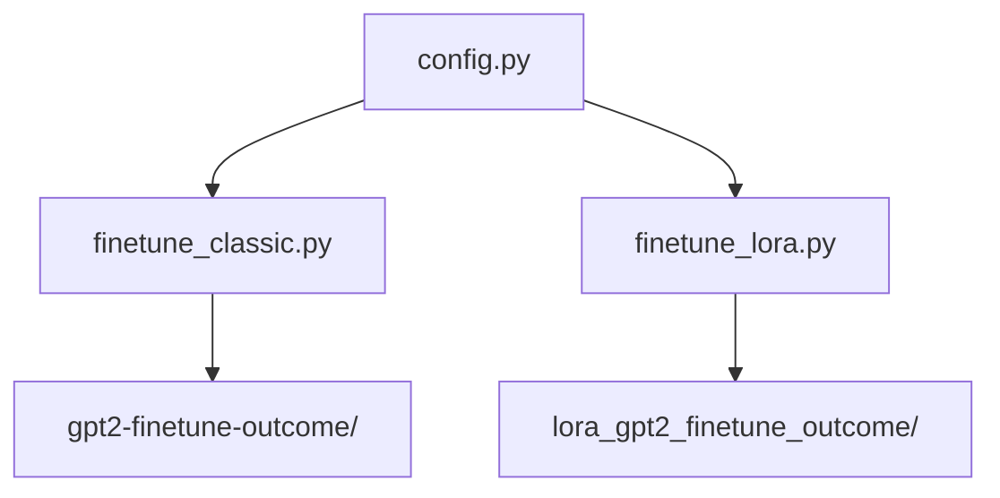

# GPT2_Finetuning Module Documentation

## Overview

The **GPT2_Finetuning** module implements the pipeline for **fine-tuning a pretrained GPT-2 model from Hugging Face** on a cybersecurity summarization dataset.

It supports two approaches:

1. **Traditional fine-tuning:**  
   → Updates **all model parameters** (standard full fine-tuning)

2. **LoRA-based fine-tuning:**  
   → Freezes base model weights and injects **Low-Rank Adaptation (LoRA)** adapters, fine-tuning only a small number of additional parameters for efficiency.

Both methods output a fine-tuned model ready for downstream evaluation or inference.

---

## Entry Points

### Classical fine-tuning

```bash
python GPT2_Finetuning/finetune_classic.py
```

### LoRA fine-tuning

```bash
python GPT2_Finetuning/finetune_lora.py
```

---

## Command-Line Flags

Both scripts accept the following flags:

| Flag                   | Description                                              |
|-----------------------|----------------------------------------------------------|
| `--search N`           | Run Optuna hyperparameter search for `N` trials.         |
| `--retrain-best-model` | After search, retrain best trial on full dataset.        |
| `--resume-from <path>` | Resume training from a saved checkpoint.                 |

Example:

```bash
python GPT2_Finetuning/finetune_lora.py --search 40 --retrain-best-model
```

## Configuration

The configuration parameters are defined in `GPT2_Finetuning/config.py`:

```python
TRAIN_ARGS = {
    "output_dir": "gpt2-finetune-outcome/",
    "per_device_train_batch_size": 8,
    "learning_rate": 5e-5,
    "num_train_epochs": 4,
    ...
}
```

You can modify hyperparameters (learning rate, epochs, output paths) by editing `config.py`.

### Configuration Reference

| Config Variable  | Description                            | Default Value   |
|-----------------|----------------------------------------|----------------|
| `TRAIN_ARGS`     | Base training hyperparameters          | {...}          |
| `LORA_RANK`      | LoRA rank hyperparameter               | 8              |
| `SEARCH_SPACES`  | Optuna hyperparam search space         | {...}          |
| `OUTPUT_DIR`     | Output folder for saving models        | gpt2-finetune-outcome/ |

Config file location:

`GPT2_Finetuning/config.py`

## File Descriptions

| File                               | Description                                                                                   |
|-----------------------------------|-----------------------------------------------------------------------------------------------|
| `config.py`                        | Contains default training arguments and hyperparameters shared by both scripts.                 |
| `finetune_classic.py`  | Performs traditional fine-tuning of Hugging Face GPT-2 on cybersecurity dataset; saves checkpoints to output folder. |
| `finetune_lora.py` | Performs LoRA-based fine-tuning of GPT-2; freezes base model weights; saves LoRA-adapted model to output folder. |

## Outputs

Running either fine-tuning script produces output folders containing checkpoints, logs, and trained models.

| Output Folder                  | Description                                                                                     |
|--------------------------------|-------------------------------------------------------------------------------------------------|
| `gpt2-finetune-outcome/`       | Contains checkpoints from traditional fine-tuning. Saved models, optimizer states, config files. |
| `lora_gpt2_finetune_outcome/`  | Contains checkpoints from LoRA fine-tuning. LoRA adapter weights, config files, logs.           |

Each folder is named `trial_<optuna_trial_index>` and includes Hugging Face-compatible saved model format:

- `pytorch_model.bin`
- `config.json`
- `training_args.bin`
- `optimizer.pt`
- `scheduler.pt`
- `trainer_state.json`
- `logs/` directory

Each trial consumes approximately:

| Mode              | Memory (VRAM/MPS) | Disk storage per trial |
|------------------|------------------|-----------------------|
| Full fine-tuning  | ~2.5 GB          | ~800 MB               |
| LoRA fine-tuning  | ~0.6 GB          | ~50 MB                |

Be mindful of disk and memory usage if running multiple trials.

## Resuming or Cleaning Checkpoints

To resume from a saved checkpoint:

```bash
python GPT2_Finetuning/finetune_classic.py --resume-from gpt2-finetune-outcome/trial_3/checkpoint-2000
```

To safely delete old checkpoints and free storage after you have performed the evaluations:

```bash
rm -rf gpt2-finetune-outcome/trial_<index>/checkpoint-*
```

Deleting checkpoints removes the ability to resume training mid-epoch.

## Running Workflow

**Train from scratch (all weights trainable):**

```bash
python GPT2_Finetuning/finetune_lora.py
```

**Train using LoRA adapters (efficient):**

```bash
python GPT2_Finetuning/inetune_lora.py
```

Both scripts automatically read hyperparameters from `config.py`.  
Both scripts save outputs in their respective folders.

## Dependencies

- Python 3.10+
- `torch >= 2.0`
- Hugging Face `transformers`
- `accelerate`
- `optuna` (if hyperparameter search is enabled inside scripts)
- `peft` (LoRA support library)

## LoRA vs Classical Fine-Tuning: Design Rationale

The LoRA fine-tuning approach in this module was tailored to balance **efficiency and overfitting prevention** for a **small dataset of 435 samples**.

Key design choices:

- LoRA adapters injected **only into `c_attn` and `c_proj`** in each transformer block (query/key/value and output projections).
- LoRA rank `r` restricted to {8, 16, 32}, limiting trainable parameters to **~0.4M–1.5M** (vs. 124M parameters in full fine-tuning).
- Early stopping enabled via validation loss monitoring.
- Optuna hyperparameter search explores low-capacity configs to avoid overfitting.

With a small curated dataset, fine-tuning the entire GPT-2 risks memorization. Narrowing LoRA injection and lowering rank reduces adaptation capacity, encouraging learning only where necessary for summarization adaptation.

Despite training <1% of base model parameters, LoRA achieved **~99% of ROUGE-1 performance vs. full fine-tuning**, while reducing storage and memory footprint.

### Trainable Parameters by LoRA Rank

| Rank `r` | Trainable parameters per `c_attn` | per `c_proj` | per layer total | 12-layer total |
|----------|----------------------------------|--------------|----------------|----------------|
| 8        | 24,576                           | 12,288       | 36,864         | 442,368        |
| 16       | 49,152                           | 24,576       | 73,728         | 884,736        |
| 32       | 98,304                           | 49,152       | 147,456        | 1,474,560      |

### Evaluation Performance Comparison

| Model                     | ROUGE-1 | ROUGE-2 | ROUGE-L |
|--------------------------|---------|----------|---------|
| GPT-2 (LoRA fine-tuned)   | 0.2303  | 0.0396   | 0.1480  |
| GPT-2 (fully fine-tuned)  | 0.2326  | 0.0460   | 0.1598  |

## Workflow Overview


