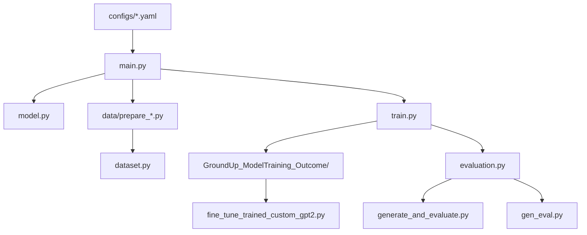

# GPT2_GroundUp Module Documentation

## Overview

The **GPT2_GroundUp** module implements the end-to-end pipeline to train a GPT-2 language model **from scratch** (i.e., without using Hugging Face pre-trained weights) on a cybersecurity or general text corpus.  
It allows customization of model architecture, training configuration, evaluation routines, and text generation.

This module provides a reproducible framework for training a domain-specific GPT-2, fine-tuning it on downstream tasks, and evaluating its summarization capabilities.

---

## Entry Point

The primary entry point is:

```bash
python GPT2_GroundUp/main.py
```

This script loads configuration files, initializes the model, loads the dataset, and launches the training process via `train.py`.  
Configuration parameters are passed via YAML files stored in `configs/`.

---

## Execution Flow

The execution pipeline follows this structure:

1. **Configuration loading:**

   - `main.py` reads YAML config from `configs/`
   - Defines model hyperparameters, dataset settings, training options

2. **Dataset preparation (via `data/prepare_*.py` scripts):**

   - Each dataset has a dedicated preparation script (see below)
   - Produces tokenized, serialized dataset saved into `data/` for training

3. **Model initialization:**

   - `main.py` calls `model.py` to build GPT-2 architecture (layer sizes, embedding dims, etc.) per config
   - Model parameters initialized from scratch

4. **Training:**

   - `main.py` triggers `train.py` to train the model
   - Uses Hugging Face `Trainer` or custom PyTorch loop
   - Saves checkpoints to `GroundUp_ModelTraining_Outcome/`

5. **Evaluation & Generation:**

   Post-training evaluation via:

   ```bash
   python GPT2_GroundUp/gen_eval.py
   # OR
   python GPT2_GroundUp/generate_and_evaluate.py
   ```

6. **Optional fine-tuning:**

   Continue training a custom checkpoint:

   ```bash
   python GPT2_GroundUp/finetune_custom_gpt2.py
   ```

---

## File Descriptions

| File                                    | Description                                                                                       |
|----------------------------------------|---------------------------------------------------------------------------------------------------|
| `main.py`                              | Orchestrates the full training pipeline. Loads config, dataset, model; triggers training. Entry point. |
| `model.py`                             | Defines GPT-2 architecture from scratch using `GPT2Config` and `GPT2LMHeadModel`.                 |
| `model_utils.py`                       | Helper utilities for model instantiation, saving/loading checkpoints.                              |
| `train.py`                             | Training loop implementation; saves checkpoints into `GroundUp_ModelTraining_Outcome/`.            |
| `dataset.py`                           | Loads tokenized datasets prepared by `prepare_*.py` scripts from `data/`.                         |
| `evaluation.py`                        | Computes ROUGE and other metrics on generated summaries.                                          |
| `gen_eval.py`                          | Automates generation + evaluation pipeline in one script.                                         |
| `generate_and_evaluate.py`             | Alternative script for generation + evaluation.                                                   |
| `finetune_custom_gpt2.py`     | Fine-tunes a previously trained custom GPT-2 model on a downstream dataset.                       |

---

## Configuration Files (`configs/`)

Each YAML file in `configs/` defines model, dataset, and training settings for a specific experiment. Example configs:

- `wikiText103.yaml` → trains GPT-2 on the WikiText-103 corpus
- `samsum.yaml` → trains GPT-2 on the SAMSum dialogue summarization dataset
- `dailydialog.yaml` → trains GPT-2 on the DailyDialog corpus
- `fine_tune_custom_gpt2.yaml` → fine-tunes a pre-trained GPT-2 checkpoint on the cybersecurity summarization dataset

Each YAML file contains:

```yaml
tokenizer:
  name: gpt2
data:
  dataset_name: <name>
  max_length: <int>
  batch_size: <int>
  stride: <int>
model:
  emb_dim: <int>
  n_layers: <int>
  n_heads: <int>
  context_length: <int>
  drop_rate: <float>
train:
  learning_rate: <float>
  num_epochs: <int>
  warmup_ratio: <float>
  model_output_path: <path>
```

`main.py` parses these configs to initialize model, tokenizer, dataset, and training parameters.

---

## Dataset Preparation Scripts (`data/`)

Each `prepare_*.py` script builds the tokenized dataset for a specific corpus:

| Script                               | Purpose                                                                                       |
|-------------------------------------|-----------------------------------------------------------------------------------------------|
| `prepare_wikiText103.py`             | Downloads WikiText-103, tokenizes it with GPT-2 tokenizer, saves preprocessed dataset for training. |
| `prepare_dailydialog.py`             | Downloads DailyDialog, tokenizes it, stores tokenized dataset for training.                    |
| `prepare_samsum.py`                  | Downloads SAMSum corpus, tokenizes dialogues and summaries, saves tokenized pairs.             |
| `prepare_finetuning_custom_gpt2.py`  | Prepares tokenized cybersecurity summarization dataset (from `DataPreprocessing/` outputs) for fine-tuning a trained GPT-2 checkpoint. |

These scripts output processed dataset files inside `data/` that `dataset.py` later loads.

Each preparation script can be run manually before training:

```bash
python GPT2_GroundUp/data/prepare_wikiText103.py
```

or equivalent for the other scripts.

---

## Inputs & Outputs

**Inputs:**

- YAML config files in `configs/`
- Tokenized datasets in `data/` (created by `prepare_*.py` scripts)

**Outputs:**

- Trained model checkpoints in `GroundUp_ModelTraining_Outcome/`
- Evaluation results logged or written to file
- Generated summaries written by generation scripts

---

## Running the Module

- **Train from scratch:**

  ```bash
  python GPT2_GroundUp/main.py --config configs/wikiText103.yaml
  ```

  (or replace YAML for other datasets)

- **Generate + evaluate after training:**

  ```bash
  python GPT2_GroundUp/gen_eval.py
  ```

- **Fine-tune existing checkpoint:**

  ```bash
  python GPT2_GroundUp/finetune_custom_gpt2.py --config configs/fine_tune_custom_gpt2.yaml
  ```

---

## Dependencies

- Python 3.10+
- Hugging Face Transformers
- PyTorch
- Datasets library
- Evaluate / `rouge_score`
- YAML parser (e.g., PyYAML)

## Workflow Overview


