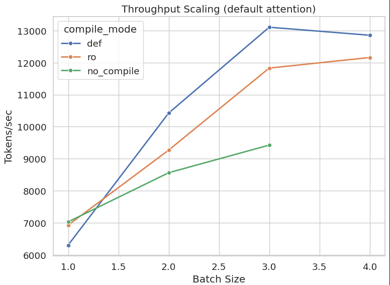
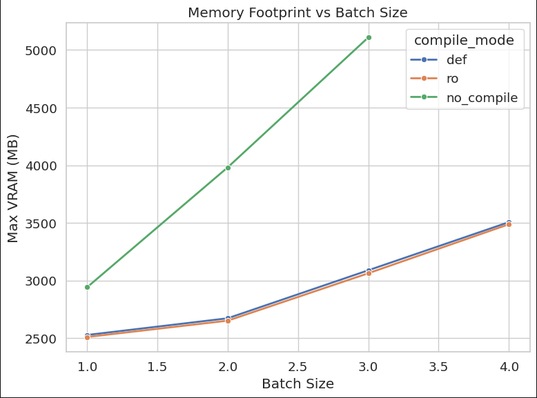
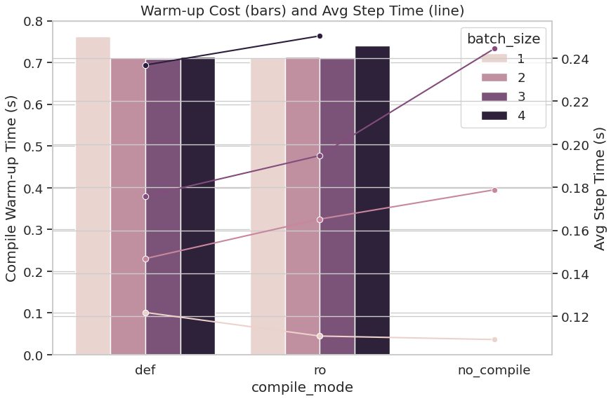
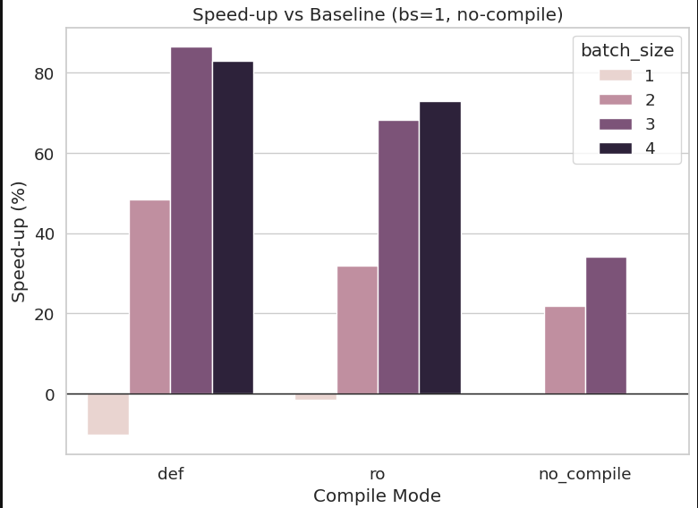
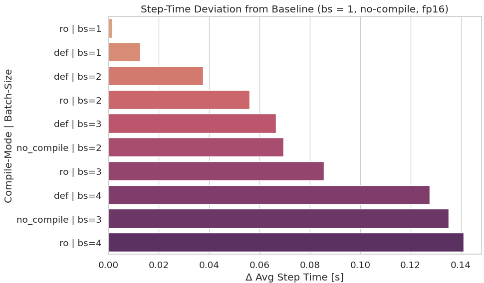

# GPT-2 Performance Benchmark Summary

## 1 · Throughput Scaling: `tokens_per_sec` vs `batch_size`

**Why we measure it**  
Throughput (tokens · s⁻¹) is the raw speed at which the model can crank out work. In training workloads it translates almost 1-for-1 to time-to-accuracy and therefore to cloud-dollars spent. In inference it is the ceiling on QPS. Scaling the batch lets us see when the GPU is saturated, when memory becomes the bottleneck, and whether Torch compile or different back-ends unlock headroom.

**Top performer (current sweep)**  
`compile_mode=ro | batch_size=5 | compile=True` → **13,565 tok/s**  
(~ +93% over the baseline)

**Why that matters & caveats**  
The gain is noticeable, but we paid for it with +34% VRAM and the highest step-time jitter of the pack (see section 5). If the GPU one has at their disposal is only an 8GB laptop card, this config is a non-starter. Also note that Torch Compile’s warm-up cost (0.71 s) is negligible for the 500-step run, but on a 20-step interactive notebook it would never break even.

---

## 2 · Memory Footprint: `max_vram` vs `batch_size`

**Why we measure it**  
Peak VRAM is the hard wall that decides whether our job fits on-device or spills to CPU / multi-GPU. It also drives the cloud instance choice (read: money) and shapes how aggressively one can scale batch or sequence length.

**Most memory-efficient (tokens/MB) seen**  
`compile_mode=def | batch_size=3 | compile=True`  
⇒ **4.24 tokens/s per MB** (13,105 tok/s on 3.09 GB)

This config gives ~86% speed-up over the baseline while adding only ~150 MB over the 3× smaller baseline batch, so it is the sweet spot if one cares about throughput-per-byte.  

**Risk:** we are now inside Torch Compile’s graph-rewriting path, code that mutates the model between calls will silently trigger a costly re-compile.

---

## 3 · Compile Trade-off: `compile_warmup_time` (bars) vs `avg_step_time` (line)

**Why we measure it**  
Torch Compile (and its “reduce-overhead” mode) buys lower steady-state latency at the price of an upfront warm-up. Whether that amortises depends on (1) how many steps one runs, and (2) how big the per-step win actually is. The bar-plus-line chart shows both knobs at once.

**Best overall deal**  
`compile_mode=def | batch_size=3`  
- Warm-up ≈ 0.71 s  
- Avg step time down from 0.244 s ➜ 0.176 s (**-28%**)  
- Break-even ≈ 11 steps (500-step run → 45× return on warm-up)

Going to `ro` had worse step-time for `bs=1–3`, and the giant `bs=5` run, while fast in throughput, adds 0.28 s latency per step — a non-starter for online inference.

---

## 4 · Speed-up Leaderboard: %Δ `tokens_per_sec` vs baseline

**Why we measure it**  
A single glance ranking that tells recruiters (or your CFO) which knob combo extracts the most juice per GPU-hour.

**Gold medal**  
`ro | bs=5 | compile=True` at **+93%**

But this is exactly the config that also tops the VRAM and jitter charts. If one runs mixed workloads or have tight latency SLOs, the silver medallist (`def | bs=3`) is probably the more balanced choice.

---

## 5 · Step-Time Jitter: |avg_step – baseline|

**Why we measure it**  
In production you often care as much about predictability as raw speed. Large jitter wreaks havoc on token-bucket budgets, distributed synchronisation, and live SLOs. Here we compute the absolute deviation from the baseline step time.

**Steadiest non-baseline run**  
`def | bs=2 | compile=True` with only **+0.038 s** deviation.

You lose some throughput (48% boost instead of 93%) but gain latency stability.  
For synchronous multi-GPU training that’s often the price worth paying.

**Risk of mis-reading this plot**  
Values are absolute, not percentage-normalised. Bigger batches will naturally skew higher just because their step time is longer. For apples-to-apples, divide by the config’s own step time and re-plot a relative jitter percentage.

---

## How and Which to choose as Best Baseline

- **Need maximum tokens/sec and have plenty of VRAM?**  
  ➤ Use `ro | bs=5 | compile=True`, but be ready for occasional latency spikes

- **Need the best speed/GB balance?**  
  ➤ Use `def | bs=3 | compile=True`

- **Need rock-solid latency for pipelined or distributed jobs?**  
  ➤ Use `def | bs=2 | compile=True`

---
## Remarks
In some of the digrams, corresponding measurements for batch size of 4 when no compilation is chosen do not appear. The main reason is that the GPU runs out of the space. Hence we cannot produce comparable results on the same machine for them. Also we have excluded the batch size of 5 from the digrams. The results however are available [here](https://github.com/MiladKetabGhale/LLM_Cybersecurity_Summarizer/blob/main/Performance_Engineering/Base_Benchmarks/results.csv).
