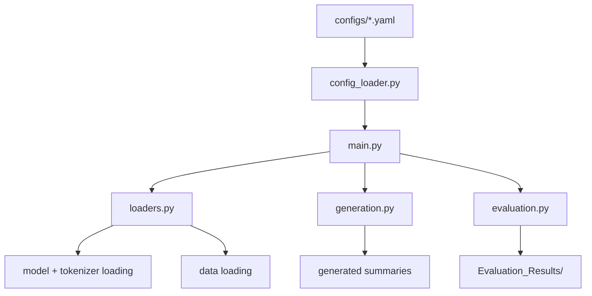

# Summary_Generation_Evaluation Module Documentation

## Overview

The **Summary_Generation_Evaluation** module implements the pipeline for **loading fine-tuned GPT-2 models**, generating summaries on cybersecurity input data, and evaluating the generated summaries against reference ground truths.

It automates:

1. Loading a trained/fine-tuned GPT-2 checkpoint
2. Generating summaries from input texts
3. Evaluating generation quality (ROUGE and other metrics)
4. Logging and saving results for later analysis

This module serves as the **inference + evaluation phase** of the system, consuming models trained by either `GPT2_GroundUp/` or `GPT2_Finetuning/`.

---

## Entry Point

The main script to run this module is:

```bash
python Summary_Generation_Evaluation/main.py
```

This script loads configuration from `configs/`, loads model and data, performs generation, evaluates results, and writes outputs into `Evaluation_Results/`.

You can specify a configuration YAML file (provided in `configs/`) to control generation and evaluation settings.

---

## Execution Flow

1. **Configuration loading** (`main.py` → `config_loader.py`):

   - Reads YAML config from `configs/` specifying model path, dataset path, generation params, evaluation params.

2. **Model and tokenizer loading** (`main.py` → `loaders.py`):

   - Loads fine-tuned GPT-2 model from path specified in config.
   - Loads tokenizer.

3. **Data loading** (`loaders.py`):

   - Loads test input texts from dataset file (JSONL).

4. **Generation** (`main.py` → `generation.py`):

   - Uses model to generate summaries for input texts.
   - Applies generation parameters (max length, temperature, etc.).

5. **Evaluation** (`main.py` → `evaluation.py`):

   - Compares generated summaries to reference summaries.
   - Computes ROUGE (and other metrics if enabled).

6. **Saving results:**

   - Saves generated outputs and evaluation metrics to `Evaluation_Results/` folder.

---

## File Descriptions

| File              | Description                                                                 |
|------------------|-----------------------------------------------------------------------------|
| `main.py`         | Orchestrates generation + evaluation pipeline. Loads config, model, data; runs generation; evaluates outputs; writes results. Entry point. |
| `config_loader.py`| Loads YAML configuration file specifying model path, dataset path, generation & evaluation params. |
| `loaders.py`      | Handles loading pretrained model, tokenizer, and input dataset.              |
| `generation.py`   | Implements text generation logic from model on input dataset using Hugging Face generation API. |
| `evaluation.py`   | Computes ROUGE and other evaluation metrics comparing generated summaries with reference summaries. |
| `prompts.py`      | Defines prompt templates if using prompt-based generation. |
| `__init__.py`     | Declares this folder as a Python module (optional).                         |

---

## Configuration Files (`configs/`)

The `configs/` folder contains YAML files defining parameters for generation and evaluation.

Each YAML file may include:

```yaml
model_path: path/to/fine_tuned_model/
dataset_path: path/to/test.jsonl
generation:
  max_length: 128
  temperature: 0.7
  top_p: 0.9
evaluation:
  metrics: [rouge]
output_dir: Evaluation_Results/Finetuned/GPT_Results/
```

These configs are loaded by `config_loader.py` and control the whole pipeline.

(→ You will provide exact YAMLs later to list here.)

---

## Outputs

Generated summaries and evaluation metrics are saved under:

```
Evaluation_Results/
├── Finetuned/
│   └── GPT_Results/
│       ├── gpt2_ft_test_<timestamp>.jsonl
│       ├── gpt2_ft_lora_test_<timestamp>.jsonl
├── ZeroShot/
│   ├── BART_Results/
│   │   └── bart-base_test_<timestamp>.jsonl
│   └── PEGASUS_Results/
│       └── pegasus-xsum_test_<timestamp>.jsonl
```

Each result file contains a list of input–generated–reference triples or evaluation scores.

Subfolders separate experiments: `Finetuned/` for models fine-tuned in-house; `ZeroShot/` for pretrained models evaluated zero-shot.

---

## Running Workflow

Run evaluation pipeline with:

```bash
python Summary_Generation_Evaluation/main.py --config configs/sum_gen_cfg_finetune_gpt2.yaml
```

(or replace config path with other YAML)

---

## Dependencies

- Python 3.10+
- Hugging Face Transformers
- `evaluate` or `rouge_score`
- `PyYAML`
- JSONL data files

## Workflow


